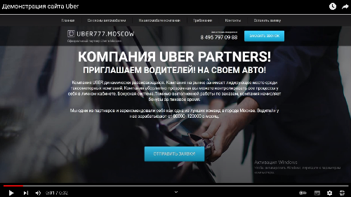

### О чем проект

Тестовая верстка сайта Uber 

При верстке сайта использовались:

- колоночная верстка bootstrap-grid  
- препроцессор SASS (миксины, переменные, псевдоэлементы)
- планировщик заданий Gulp
- адаптация верстки по различные размеры экранов, используя медиа-запросы (@media)
- написание кода на JavaScript для интерактивной части

### Демонстрация

#### Версия для ПК

#### Мобильная версия

